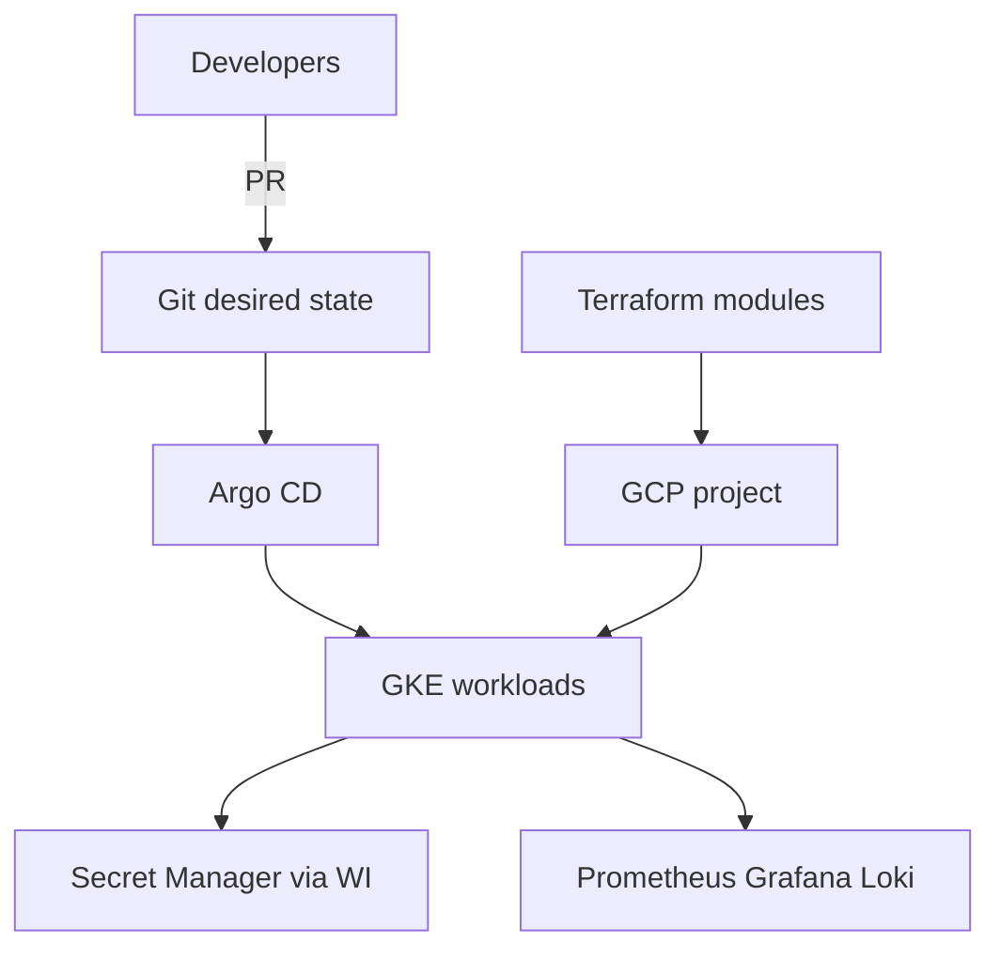

# Platform architecture

## Boundaries

| Layer | Owns | Does not own |
|---|---|---|
| Terraform | Networks, clusters, IAM scaffolding, secret *containers* | App release cadence |
| Argo CD / k8s | Workload desired state | Cloud account bootstrap |
| App repo | Code, image build, migration expand/contract | Cluster creation |
| Observability | SLIs/SLO dashboards, log pipelines | Business logic |

## Health and autoscaling defaults

- Readiness probe gates Service traffic
- Liveness probe restarts stuck processes
- HPA on CPU as a baseline (extend with custom metrics for queue)
- PDB keeps minimum available during voluntary disruption
- preStop sleep cooperates with LB connection draining
